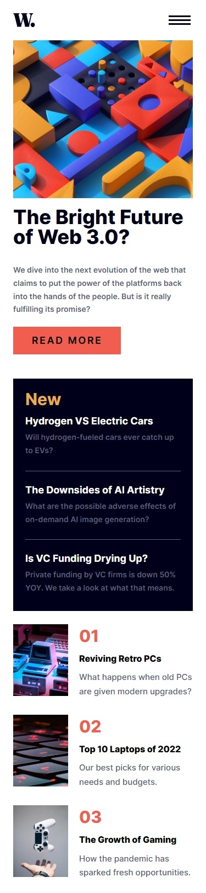
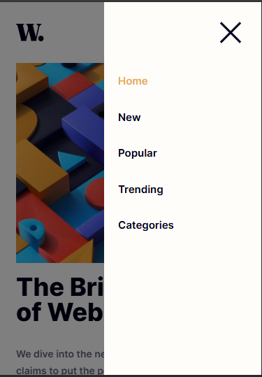
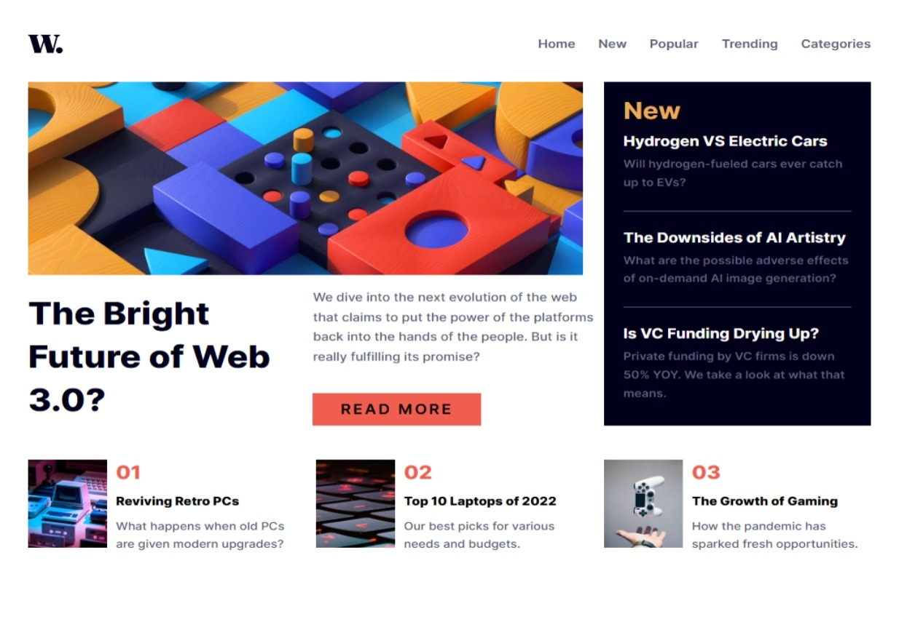
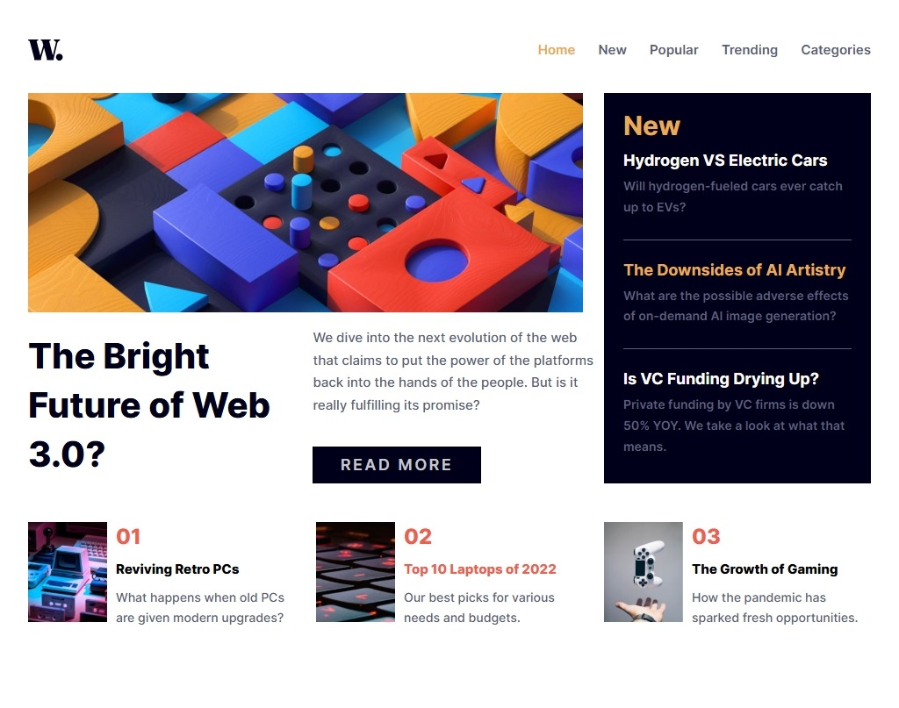

# news-homepage-main

This is a solution to the [news-homepage-main on Frontend Mentor](https://www.frontendmentor.io/challenges/news-homepage-H6SWTa1MFl). Frontend Mentor challenges help you improve your coding skills by building realistic projects. 

## Table of contents

- [Overview](#overview)
  - [Screenshot](#screenshot)
  - [Links](#links)
- [My process](#my-process)
  - [Built with](#built-with)
  - [What I learned](#what-i-learned)
  - [Continued development](#continued-development)
- [Author](#author)

## Overview

### Screenshot

These are my screenshots showing how the project turned out.

- Mobile design:



- Mobile menu:



- Desktop design:



- Active state:



### Links

- Solution URL: [My Solution](https://github.com/gillaercio/news-homepage-main)

## My process

### Built with

- Semantic HTML5 markup
- CSS custom properties
- Flexbox
- CSS Grid
- Mobile-first workflow
- JavaScript

### What I learned

I took advantage of this project to practice using **BEM** with HTML, **Pseudo-elements** and **Reset CSS** with **CSS** and **Events** with **JavaScript**:

BEM (Block Element Modifier)

```html
  <article class="sidebar__item">
    <h3 class="sidebar__headline">Hydrogen VS Electric Cars</h3>
    <p class="sidebar__text">Will hydrogen-fueled cars ever catch up to EVs?</p>
  </article>
```

Pseudo-element

```css
*,
*::before,
*::after {
  margin: 0;
  padding: 0;
  box-sizing: border-box;
}
```

Events

```js
menuToggle.addEventListener('click', () => {
  const isOpen = navMenu.classList.toggle('is-open');

  menuToggle.setAttribute('aria-expanded', isOpen ? 'true' : 'false');

  if (isOpen) {
    menuIcon.src = 'assets/images/icon-menu-close.svg';
    menuIcon.alt = 'Close menu';

    const scrollBarWidth = window.innerWidth - document.documentElement.clientWidth;
    if (scrollBarWidth > 0) {
      document.body.style.paddingRight = `${scrollBarWidth}px`;
    }

    scrollPosition = window.scrollY || window.pageYOffset || 0;

    content.style.top = `-${scrollPosition}px`;

    document.body.classList.add('menu-open');
  } else {
    const top = content.style.top;
    menuIcon.src = 'assets/images/icon-menu.svg';
    menuIcon.alt = 'Open menu';

    document.body.classList.remove('menu-open');
    document.body.style.paddingRight = '';
    content.style.top = '';
    const restoredScroll = Math.abs(parseInt(top || '0', 10)) || 0;
    window.scrollTo(0, restoredScroll);
  }
});
```

### Continued development

I would like to improve the use of the **HTML**, **CSS** and **JavaScript**.

## Author

- Frontend Mentor - [@gillaercio](https://www.frontendmentor.io/profile/gillaercio)
- Github - [My Github](https://github.com/gillaercio)
- LinkedIn - [My LinkedIn](https://www.linkedin.com/in/gildman-la%C3%A9rcio/)